# ArchiFlow — Screenshots

This folder contains annotated screenshots of the **ArchiFlow** application, ordered to follow the natural user journey from first visit through core features.

## Authentication Flow

### 1. Login

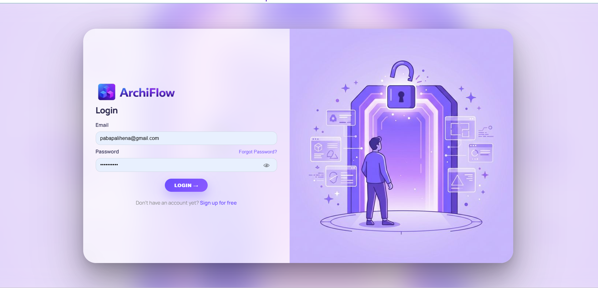

### 2. Registration

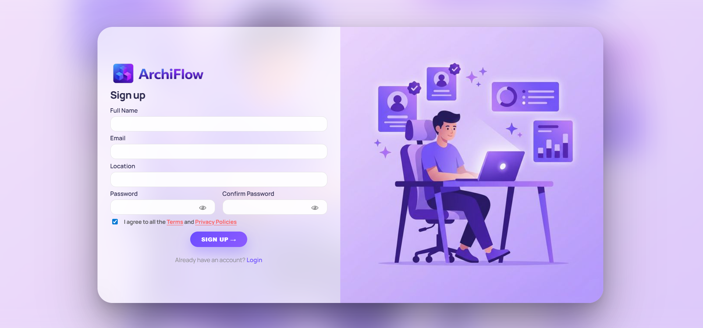

New users register by providing a **display name, email address, and password**. The form includes client-side validation and a link back to the Login page. Upon successful registration, users are redirected to log in.

### 3. Forgot Password / OTP Reset

Users who have forgotten their password can initiate an **OTP-based reset**. An email containing a one-time passcode is sent via Nodemailer (SMTP). The user enters the OTP to verify their identity and set a new password.

### 4. Terms & Conditions

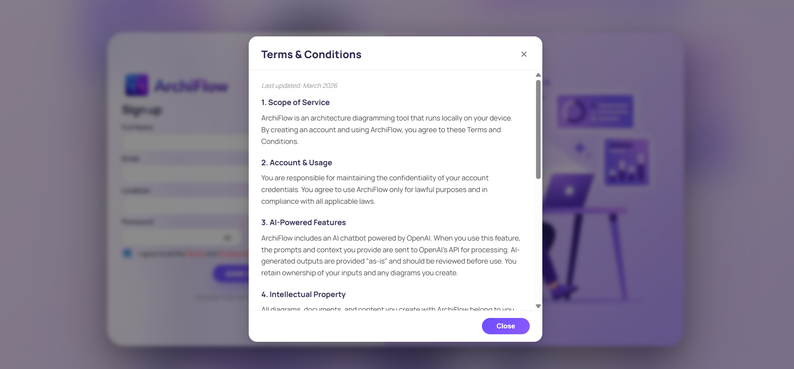

The Terms & Conditions page outlines the **acceptable use policy, intellectual property rights, and disclaimer** for the ArchiFlow platform. Users must acknowledge these terms during account creation or as part of the onboarding flow.

## Main Canvas Editor

### 5. Main Canvas

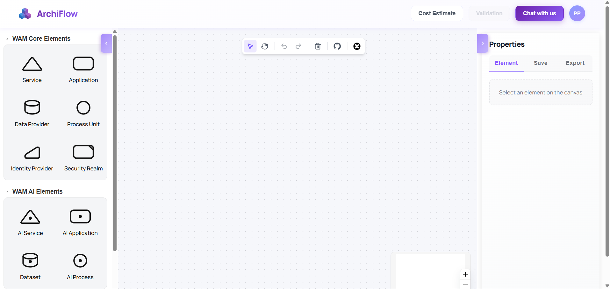

The **Main Canvas** is the core of ArchiFlow — a React Flow–powered interactive editor where users drag and drop WAM (Webcomposition Architecture Model) elements to design system architectures visually.

### 6. Diagram Design

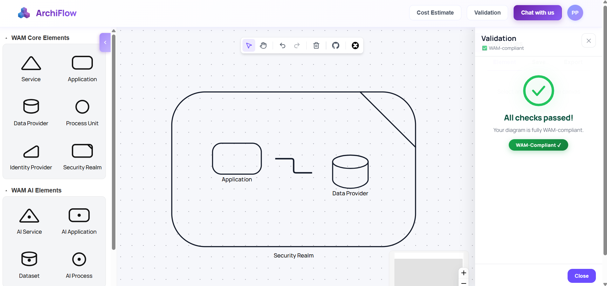

A fully built-out diagram showing multiple WAM nodes connected by **custom editable edges with waypoints**. Nodes can be repositioned freely; edges support handle reassignment and animated connection indicators.

### 7. My Diagrams

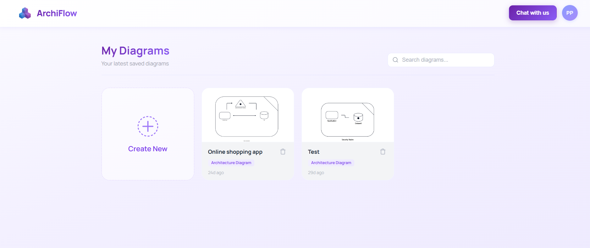

After login, users land on the **My Diagrams** dashboard. This view lists all saved architecture diagrams stored in MongoDB, with options to **open, rename, or delete** each diagram. Users can also create a new diagram from here.

## Properties & Configuration

### 8. Property Panel — Overview

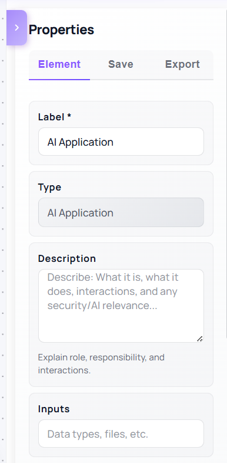
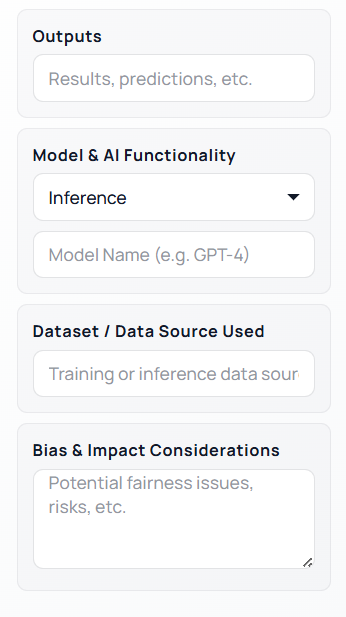
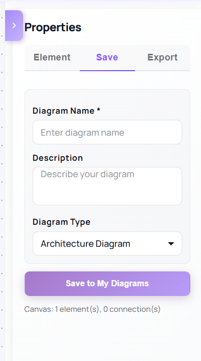
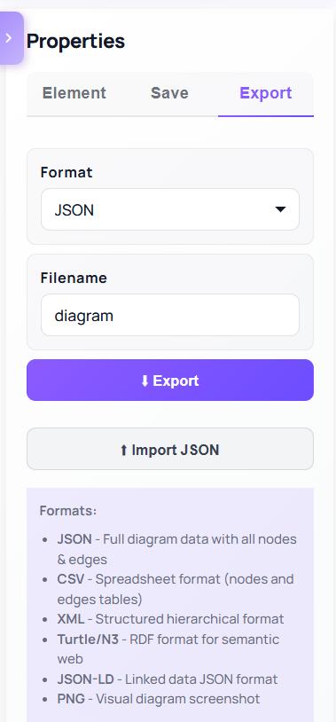

The **Property Panel** is the right-hand sidebar that activates when a WAM element is selected on the canvas. It is organized into multiple tabs to support a structured configuration workflow:

- **Element Tab** — Allows users to label the selected element, write a description, and customize edge connections between components directly from the panel.
- **Save Tab** — Users can save the current diagram state to MongoDB, preserving all node positions, edge configurations, and property data at any point during design.
- **Export Tab** — Provides multiple export formats (e.g. PNG, JSON, JSON_LD, XML,RDF) so users can share or archive their architecture diagrams. An **import** option is also available, allowing users to load a previously exported diagram back into the canvas.

## AI Features

### 12. AI Chat Assistant

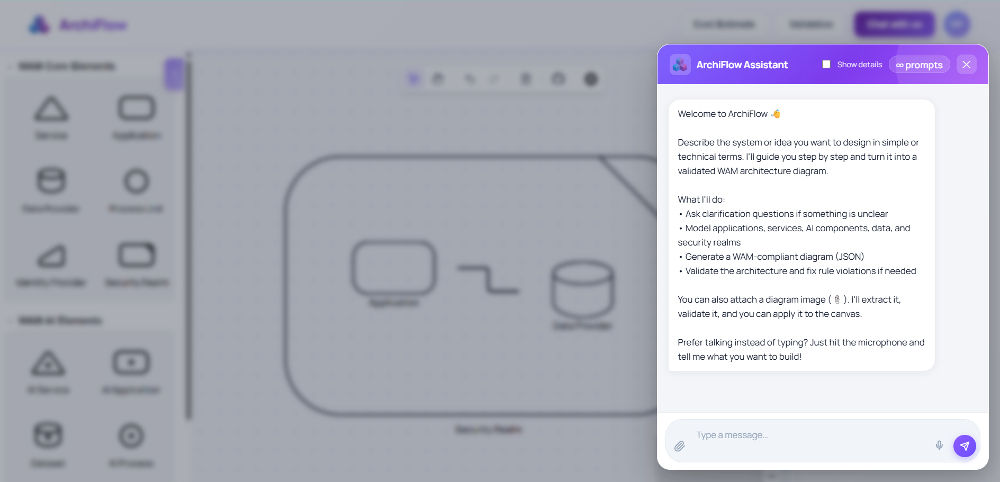

ArchiFlow's AI assistant is deeply integrated into the design workflow. Users can **type a prompt in natural language** — for example, describing a system they want to model — and the AI will generate a corresponding architecture diagram directly on the main canvas. **Voice prompts are also supported**, allowing users to speak their request hands-free using the microphone button. Additionally, if a user **uploads an existing diagram** that contains errors or structural issues, the AI analyzes it and displays a corrected, improved version on the canvas automatically.

### 14. Cost Estimation

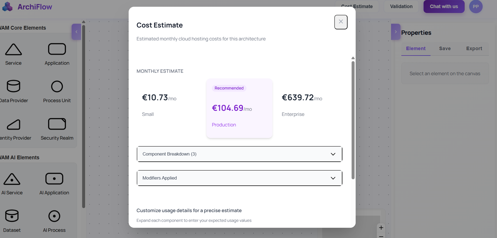

The **Cost Estimation** panel analyzes the WAM elements in the diagram and provides estimated **monthly hosting and infrastructure costs** based on cloud pricing models. Results are broken down per component.

### 15. Pricing Overview

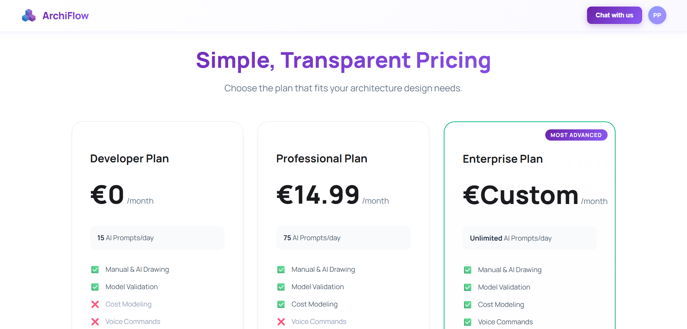
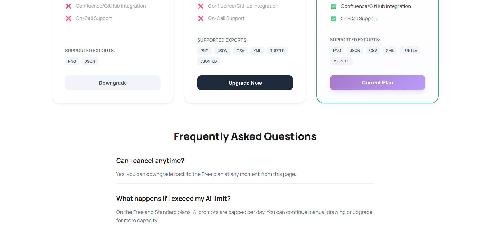

ArchiFlow offers **three subscription tiers** to match different user needs:

- **Free Tier** — Access to core canvas features, limited diagram storage, and basic AI usage. Ideal for individual users exploring the platform.
- **Premium Tier** — Unlocks advanced AI capabilities, increased diagram limits, documentation export, and priority email support.
- **Enterprise Tier** — Full access to all features including team collaboration, custom integrations, extended cloud pricing data, and dedicated support.

## Integrations

### 17. Integration Hub

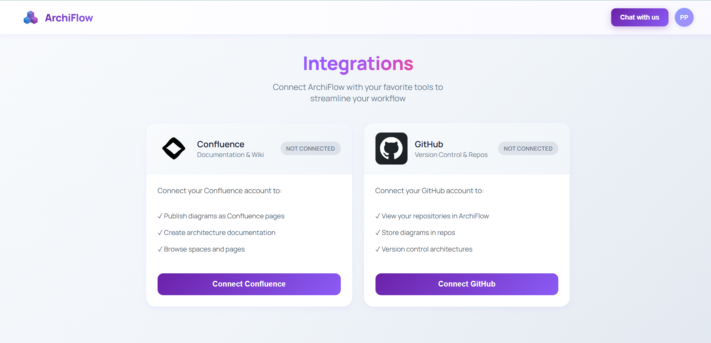

The **Integration Hub** shows all available third-party service connections. Users can enable or disable integrations that are linked to their ArchiFlow workspace.

### 18. GitHub Integration

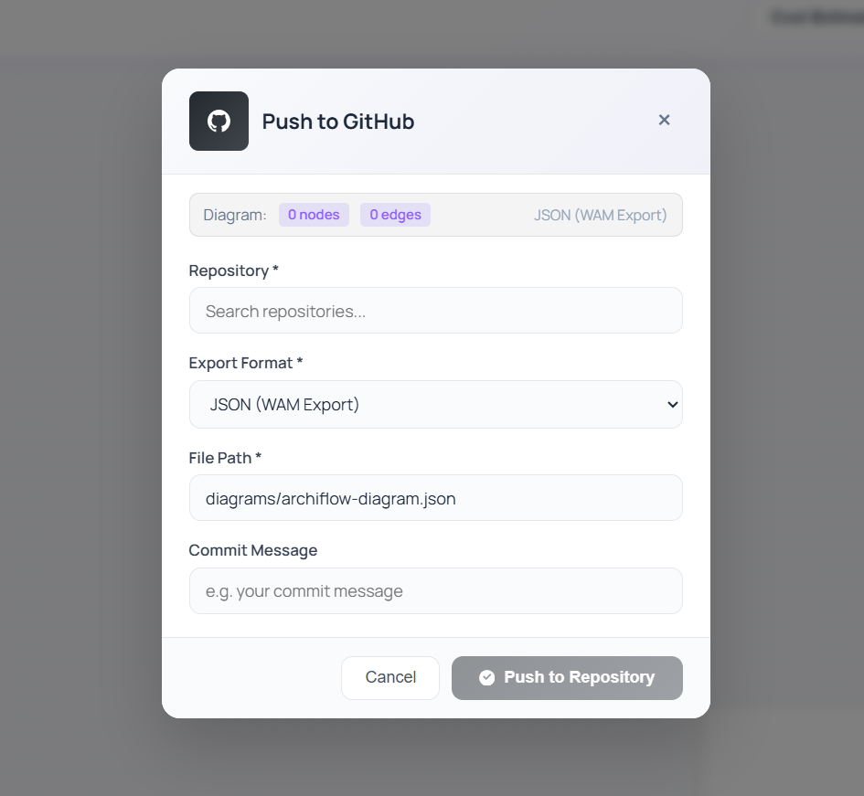

The **GitHub integration** allows users to link their repositories to WAM elements, enabling direct navigation to relevant source code from within the architecture diagram.

### 19. Confluence Integration

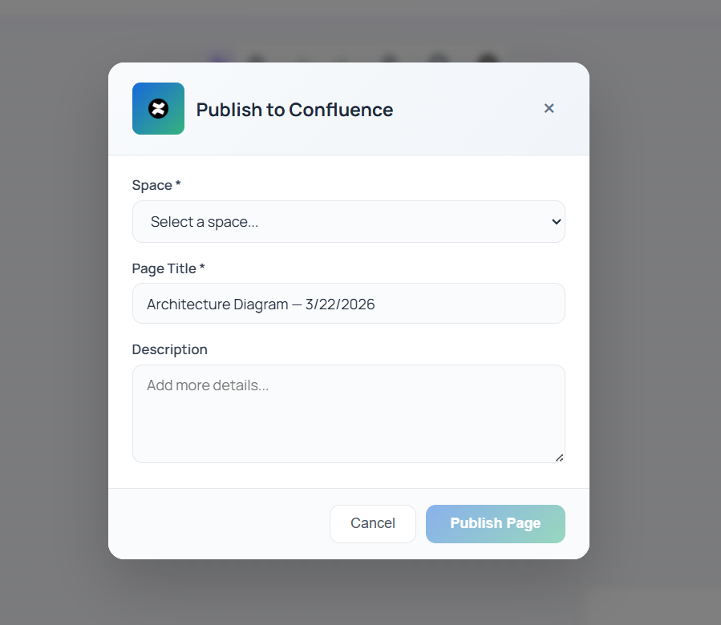

The **Confluence integration** connects ArchiFlow architecture diagrams to Confluence project spaces, enabling seamless documentation synchronization.

## User Profile & Settings

### 20. User Profile

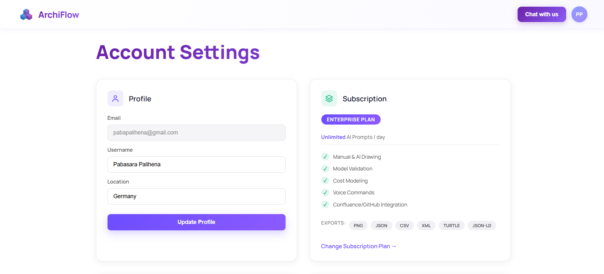
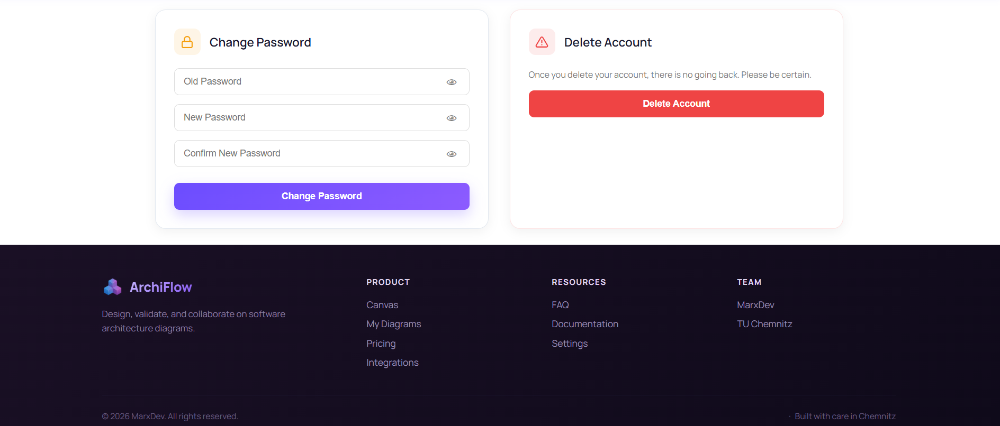
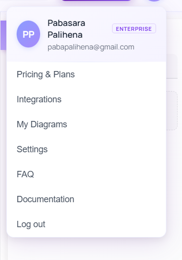

The **User Profile** section allows users to view and manage their account details, including display name, email address, and profile picture. Users can also see their current **subscription tier** and switch plans from here. A compact profile card is displayed in the navigation sidebar showing the avatar, name, and plan badge at a glance.

## Help & Support

### 23. FAQ

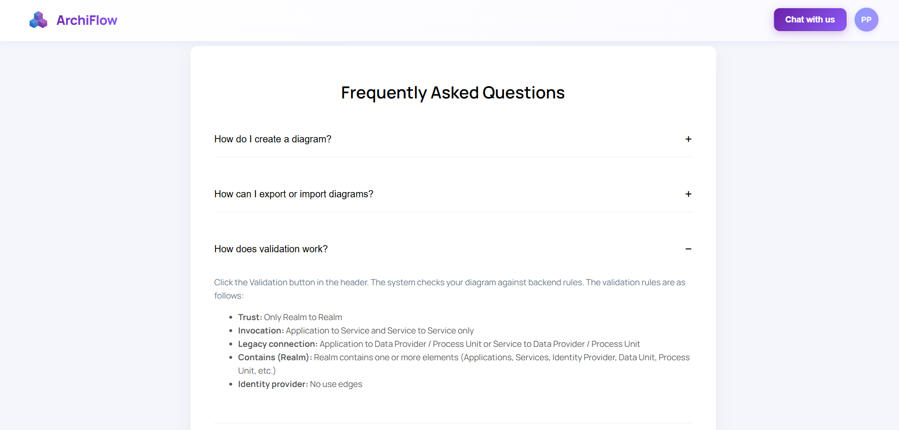

The **FAQ page** provides answers to common questions about using ArchiFlow, including how to start a diagram, use AI features, manage diagrams, and handle billing.

### 24. Documentation

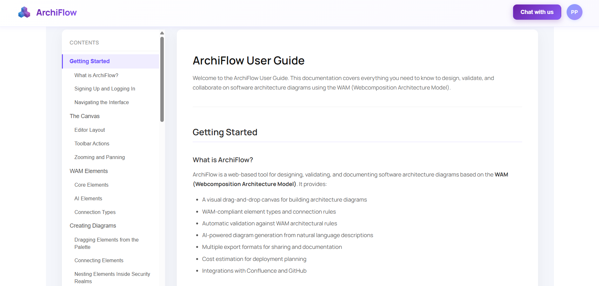

The **Documentation** page serves as a built-in **software user guide** for ArchiFlow. It provides structured guidance on how to use the platform's features, helping users understand the tools and workflows available to them.

  Screenshots taken from the <strong>ArchiFlow</strong> research prototype. 
  Built by the <strong>MarxDev Development Team</strong> · <a href="https://marxdev.vercel.app/">marxdev.vercel.app</a>

